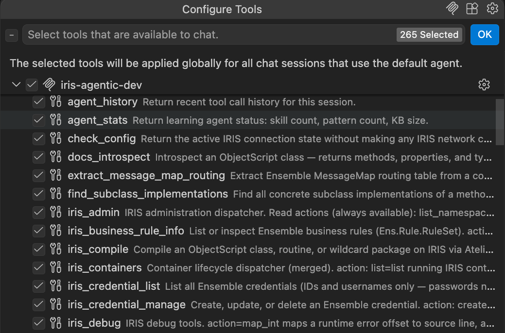
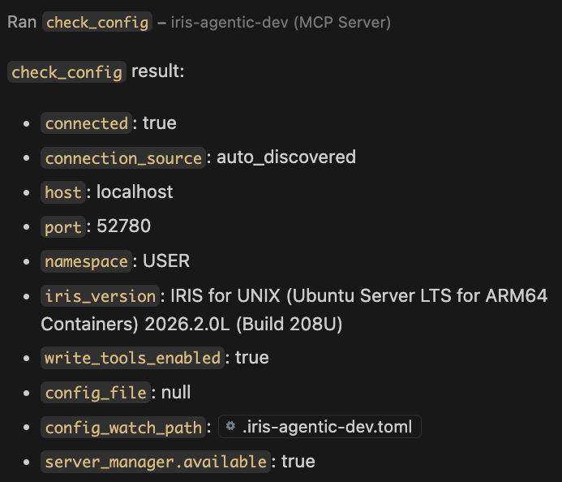

# iris-agentic-dev

Connect GitHub Copilot, Claude Code, and other AI coding assistants directly to a live
InterSystems IRIS instance. The AI can compile classes, run ObjectScript, execute SQL,
search the namespace, run unit tests, and inspect class definitions — without leaving the
chat.

Works with IRIS installed natively on Windows or Linux, and with Docker. Requires
IRIS 2023.1 or later.

---

## Quick start: VS Code + GitHub Copilot

This is the fastest path if you already use VS Code with the InterSystems ObjectScript
extension.

**Prerequisites**: VS Code, GitHub Copilot,
[InterSystems ObjectScript extension](https://marketplace.visualstudio.com/items?itemName=intersystems-community.vscode-objectscript)

1. Download `vscode-iris-agentic-dev-*.vsix` from the
   [releases page](https://github.com/intersystems-community/iris-agentic-dev/releases/latest)
2. In VS Code: Extensions (`Ctrl+Shift+X`) → `...` → **Install from VSIX**
3. Reload VS Code

**iris-agentic-dev (IRIS)** now appears in **Copilot Chat → Agent mode → tools**. It reads
your existing `objectscript.conn` or `intersystems.servers` configuration — no additional
setup needed.



To verify the connection, ask Copilot: *"Call check_config and show me the result."*



> **Windows users**: iris-agentic-dev works with native IRIS on Windows — Docker is not
> required. If you hit a 404 on `/api/atelier`, see the
> [Windows IIS setup](docs/connecting.md#windows-iis-api-web-application-required) guide.

---

## Quick start: Claude Code / OpenCode

**Install the binary:**

```bash
# Mac (Homebrew)
brew tap intersystems-community/iris-agentic-dev
brew install iris-agentic-dev

# Mac direct download (Apple Silicon)
curl -fsSL https://github.com/intersystems-community/iris-agentic-dev/releases/latest/download/iris-agentic-dev-macos-arm64 \
  -o /usr/local/bin/iris-agentic-dev && chmod +x /usr/local/bin/iris-agentic-dev
xattr -d com.apple.quarantine /usr/local/bin/iris-agentic-dev 2>/dev/null

# Linux x86_64
curl -fsSL https://github.com/intersystems-community/iris-agentic-dev/releases/latest/download/iris-agentic-dev-linux-x86_64 \
  -o /usr/local/bin/iris-agentic-dev && chmod +x /usr/local/bin/iris-agentic-dev
```

**Windows**: Download `iris-agentic-dev-windows-x86_64.exe` from the
[releases page](https://github.com/intersystems-community/iris-agentic-dev/releases/latest)
and place it on your PATH.

**Configure Claude Code** — add to `~/.claude.json`:

```json
{
  "mcpServers": {
    "iris-agentic-dev": {
      "command": "iris-agentic-dev",
      "args": ["mcp"],
      "env": {
        "IRIS_HOST": "localhost",
        "IRIS_WEB_PORT": "52773",
        "IRIS_USERNAME": "_SYSTEM",
        "IRIS_PASSWORD": "SYS",
        "IRIS_NAMESPACE": "USER"
      }
    }
  }
}
```

**Configure OpenCode** — add to `~/.config/opencode/config.json`:

```json
{
  "mcp": {
    "iris-agentic-dev": {
      "type": "local",
      "command": ["/usr/local/bin/iris-agentic-dev", "mcp"],
      "enabled": true,
      "environment": {
        "IRIS_HOST": "localhost",
        "IRIS_WEB_PORT": "52773",
        "IRIS_USERNAME": "_SYSTEM",
        "IRIS_PASSWORD": "SYS",
        "IRIS_NAMESPACE": "USER"
      }
    }
  }
}
```

Note: OpenCode uses `"type": "local"` and `"environment"` (not `"type": "stdio"` and `"env"`).

**WSL2**: The Windows OpenCode GUI cannot spawn Linux ELF binaries. Use the Windows `.exe`
or invoke the Linux binary via `wsl.exe`:

```json
"command": ["wsl.exe", "-e", "/usr/local/bin/iris-agentic-dev", "mcp"]
```

---

## Skills — improve AI output for ObjectScript

Skills are concise instruction files that teach your AI assistant ObjectScript patterns and
common mistakes. The top skill (`objectscript-review`) brings the repair benchmark from 73%
to **100%** on 22 tasks.

```bash
mkdir -p ~/.claude/skills
for skill in objectscript-review objectscript-guardrails objectscript-sql-patterns; do
  mkdir -p ~/.claude/skills/$skill
  curl -sL https://raw.githubusercontent.com/intersystems-community/iris-agentic-dev/master/light-skills/skills/$skill/SKILL.md \
    > ~/.claude/skills/$skill/SKILL.md
done
```

See [docs/skills.md](docs/skills.md) for the full skill inventory, benchmark results, and
loading cautions.

---

## Documentation

| Guide | Contents |
|-------|----------|
| [docs/connecting.md](docs/connecting.md) | Native IRIS, Docker, Server Manager, policy gates, env vars, discovery order |
| [docs/tools.md](docs/tools.md) | Full tool catalog with descriptions and error codes |
| [docs/skills.md](docs/skills.md) | Skill inventory, benchmark results, install instructions |
| [docs/troubleshooting.md](docs/troubleshooting.md) | Symptom table, CLI commands, verbose logging |

---

## Contributing

Issues and pull requests are welcome at the
[Issues tab](https://github.com/intersystems-community/iris-agentic-dev/issues).

To contribute a skill — write a `SKILL.md`, run the benchmark, submit a PR with results.
See [BENCHMARKING.md](./light-skills/BENCHMARKING.md).

Questions: [thomas.dyar@intersystems.com](mailto:thomas.dyar@intersystems.com)
